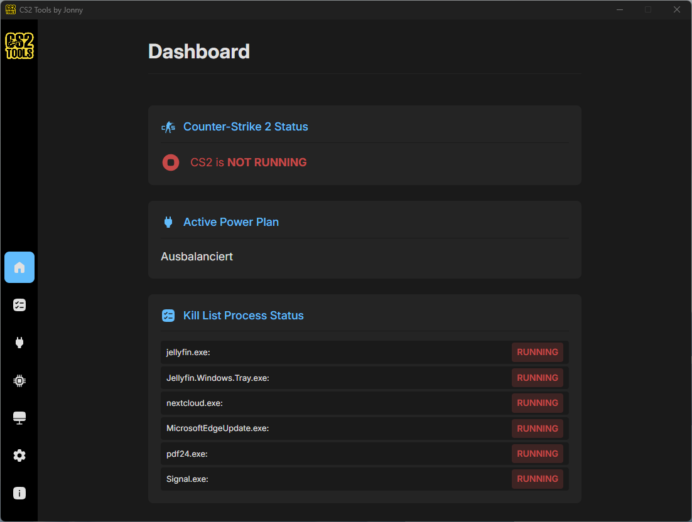
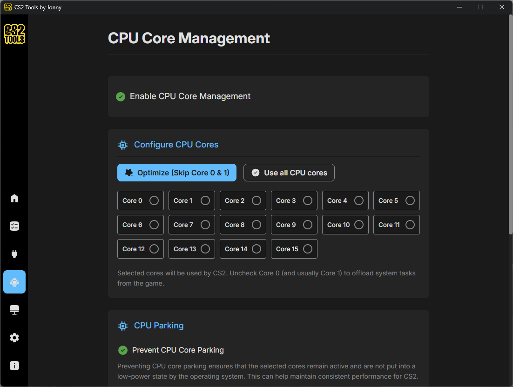
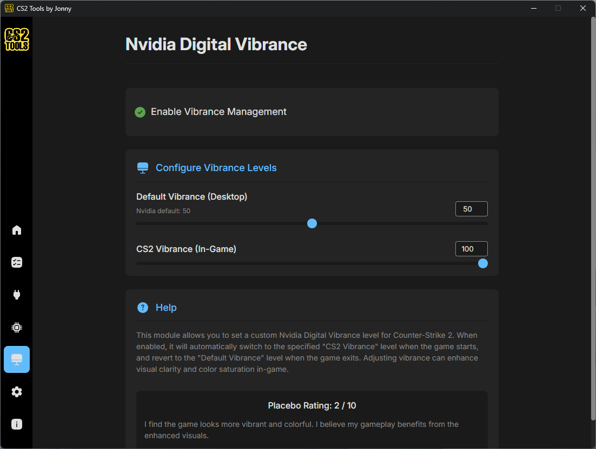
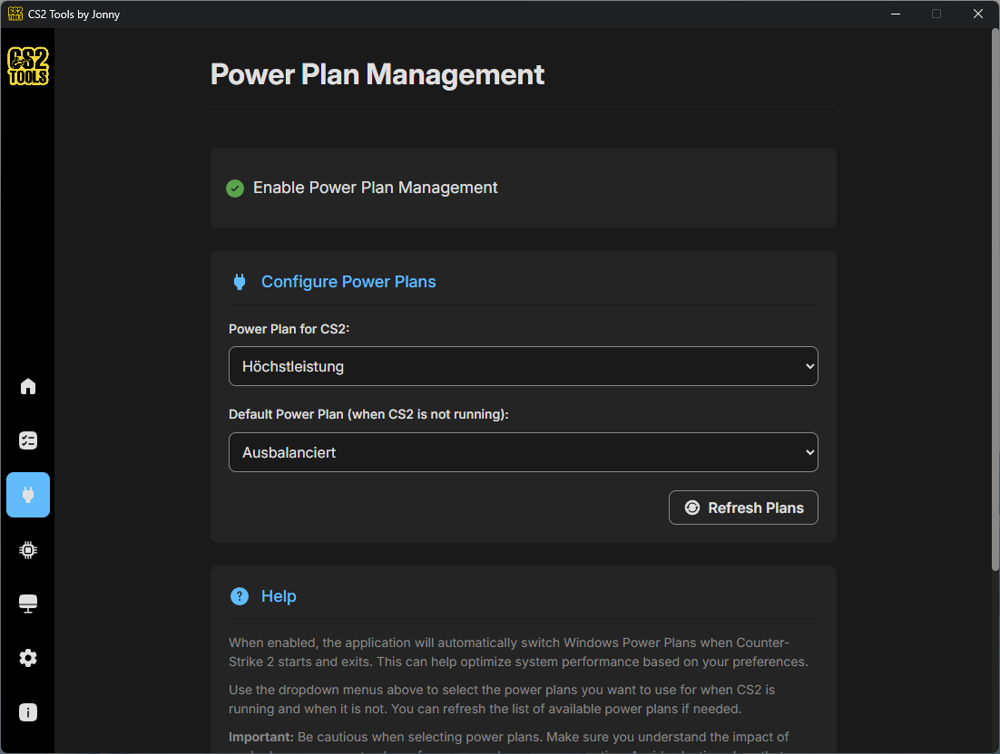
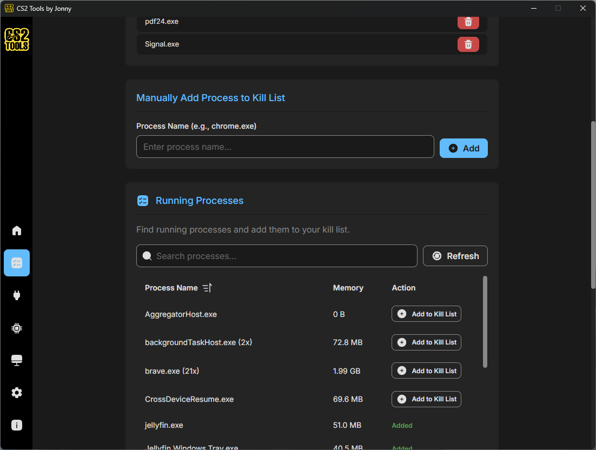

<div align="center">
  

# CS2 Tools by Jonny

**Maximize your competitive edge in Counter-Strike 2 with intelligent system optimization.**

[](https://github.com/Code-Jonny/cs2tools-by-jonny/releases)
[](https://github.com/Code-Jonny/cs2tools-by-jonny)
[](https://github.com/Code-Jonny/cs2tools-by-jonny/blob/main/LICENSE)

  <p align="center">
    <a href="#-features">Features</a> •
    <a href="#%EF%B8%8F-screenshots">Screenshots</a> •
    <a href="#-installation-github-binaries">Installation</a> •
    <a href="#%EF%B8%8F-building-from-source">Building from Source</a> •
    <a href="#-faq">FAQ</a> •
    <a href="#completely-free">Completely free</a> •
    <a href="#-roadmap--wishlist">Roadmap</a>
  </p>
</div>

---

<br>

## 🚀 About

**CS2 Tools By Jonny** is a lightweight Windows utility that swaps power plans, pins CPU cores, kills bloat processes, and bumps Nvidia vibrance the moment CS2 launches — and reverts it all when you're done.
<br><br><br>

## ✨ Features

| Feature                        | Description                                                                                                                                                      |
| :----------------------------- | :--------------------------------------------------------------------------------------------------------------------------------------------------------------- |
| **⚡ Power plan switching**    | Auto-switch to High Performance when CS2 starts and back to Balanced when it closes (or any other custom power plan). No manual toggling.                        |
| **💀 Process kill list**       | Define a list of background bloat — Discord overlays, sync clients, browsers — and have them shut down on launch.                                                |
| **🎨 Nvidia Digital Vibrance** | **(Nvidia Only)** Bumps saturation only while CS2 is the focused window, on the monitor running CS2. Alt-tab away and your normal vibrance comes back instantly. |
| **🧠 CPU core management**     | Pin CS2 to the exact cores you choose. Skip cores 0 & 1 to leave them for the OS, use all of them or define a custom core distribution template.                 |
| **🪟 Live status dashboard**   | See what's running, what got killed, and which power plan is active — all from a single overview screen.                                                         |
| **🪶 Featherweight by design** | Built with Tauri (Rust + Vue), not Electron. Under 20 MB on disk and barely a blip on memory — because optimizing perf with a bloated app would be absurd.       |
| **🔄 Reverts everything**      | When CS2 exits, every setting goes back to your defaults. No admin rights, no permanent “gaming mode.”                                                           |
| **🛡️ VAC Safe**                | Works strictly with Windows / nVidia APIs. Does **not** touch game memory or game files.                                                                         |

<br><br><br>

## 🖼️ Screenshots

<p align="center">
  <a href="screenshots/dashboard.png"></a>
  <a href="screenshots/cpu-core-management.png"></a>
</p>
<p align="center">
  <a href="screenshots/nvidia-vibrance.png"></a>
  <a href="screenshots/power-plans.png"></a>
</p>
<p align="center">
  <a href="screenshots/process-management.png"></a>
</p>
<br><br><br>

## ⚙️ How It Works

The application intelligently monitors for `cs2.exe`.

**When the game starts:**

1.  Terminates processes in your "Kill List".
2.  Switches to your designated Power Plan.
3.  Applies Digital Vibrance settings.
4.  Applies CPU Affinity rules and prevents CPU Core Parking.

**When the game closes:**

1.  Reverts to your previous Power Plan (Default Power Plan).
2.  Restores your Desktop Vibrance level.
3.  Restores default CPU Core Parking states.

<br><br><br>

## 📥 Installation (Github Binaries)

1.  **Download** the latest installer from the [Releases Page](https://github.com/Code-Jonny/cs2tools-by-jonny/releases).
2.  **Install** the application.
3.  **Run** `CS2 Tools by Jonny` via the desktop shortcut or start menu.

<br><br><br>

## 📥 Installation (Microsoft Store)

1.  **Visit** the [Microsoft Store](https://apps.microsoft.com/detail/9PHSNKWF7QM4).
2.  **Install** the application.
3.  **Run** `CS2 Tools by Jonny` via the desktop shortcut or start menu.

<br><br><br>

## 🛠️ Building from Source

### Requirements

To build the application yourself, you need to set up the Tauri v2 Windows development environment:

- **[Node.js](https://nodejs.org/en)** (v18 or newer)
- **[pnpm](https://pnpm.io/installation)** package manager
- **[Rust](https://rustup.rs/)** (v1.77.2 or newer)
- **C++ Build Tools**: Install via the Visual Studio Installer (Select "Desktop development with C++")
- **Windows 10/11 SDK**: Included with the C++ Build Tools workload

### Step-by-Step Build Process

1. **Clone the repository:**

   ```bash
   git clone https://github.com/Code-Jonny/cs2tools-by-jonny.git
   cd cs2tools-by-jonny
   ```

2. **Install frontend and backend workspace dependencies:**

   ```bash
   pnpm install
   ```

3. **Run the app in Development Mode (Live Reload):**

   ```bash
   pnpm run tauri dev
   ```

   _This starts the Vite development server and launches the Tauri window._

4. **Build the Release binaries:**
   ```bash
   pnpm build:release
   ```
   _This command runs `tauri build` to compile the Rust backend, and then executes custom post-build scripts `build-tools/binaries/` directory. Note: This command runs the msix-packaging script at the end that I need for publishing my releases on the Microsoft Store. You likely won't need that and will instead run into errors because it depends on additional dependencies._
   <br><br><br>

## ❓ FAQ

<details>
<summary><strong>Is this safe? Will I get VAC banned?</strong></summary>
<br>
Yes, it is safe. CS2 Tools operates entirely outside of the game. It manages Windows settings (Power Plans, CPU Core Management, NVidia Digital Vibrance Settings) and does not interact with the game's memory or inject code.
</details>

<details>
<summary><strong>Does it improve FPS?</strong></summary>
<br>
Yes, mostly by improving frametime consistency (1% lows). By moving background tasks and ensuring the CPU uses the best fitting cpu cores, the game runs smoother.
</details>

<details>
<summary><strong>What is the performance impact of the app itself?</strong></summary>
<br>
Negligible. Built with Tauri 2 and Rust, it uses minimal RAM and CPU to ensure no performance tax on your system. The app itself consume less than 20 MByte on you disk.
</details>

<details>
<summary><strong>I get a warning when I start the app. What does it mean?</strong></summary>
<br>
That happens because the installation file you downloaded from Github is not digitally signed. If you want to avoid this you can install the app from the Microsoft Store.
</details>
<br><br><br>

## 💲Completely free

This app is completely free: no subscription, no one time fee.

If you'd like to show your support (and only if you can afford to!), you can tip me via [PayPal](https://www.paypal.com/donate/?hosted_button_id=ZY4J7VV2AV2HC) here or you can send me a nice CS2 skin on [Steam](https://steamcommunity.com/tradeoffer/new/?partner=472413666&token=r8OLzAvB).

<br><br><br>

## 🔮 Roadmap & Wishlist

### Planned

- [ ] **Config Switcher**: Manager for `autoexec.cfg` and `video.txt`.
- [ ] **Auto-Updates**: In-app update notifications.
- [ ] **Color Management**: Advanced LUT curves for R/G/B channels.

### Under Consideration

- **System Overlay**: In-game CPU/GPU temps (feasibility study in progress).
- **Community Profiles**: Share/Import optimization configs.
- **Server Status**: Embedded Steam Status checker.

---

<div align="center">
  <sub>Built with Vue 3.5, Tauri v2, and Rust. Designed for the CS2 Community.<br>
  By Jonny - https://steamcommunity.com/id/J-o-n-n-y/</sub>
</div>
