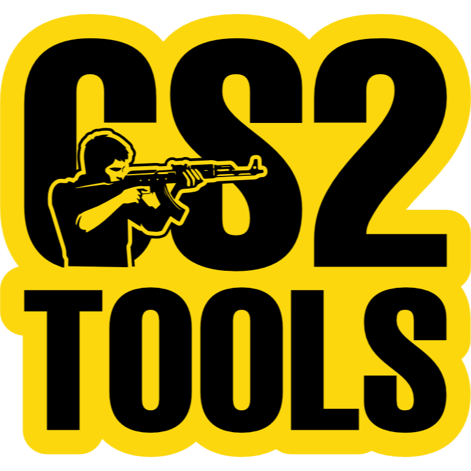

  

# CS2 Tools by Jonny

**Maximize your competitive edge in Counter-Strike 2 with intelligent system optimization.**

  

    <a href="#-features">Features</a> •
    <a href="#-installation">Installation</a> •
    <a href="#-usage">Usage</a> •
    <a href="#-roadmap">Roadmap</a>
  

---

## 🚀 About

**CS2 Tools** is a lightweight, high-performance utility built with **Tauri v2** (Rust and Vue). It runs quietly in the background to enforce optimal system conditions whenever you play Counter-Strike 2, and cleans up when you're done.

## ✨ Features

| Feature                        | Description                                                                                                                           |
| :----------------------------- | :------------------------------------------------------------------------------------------------------------------------------------ |
| **⚡ Power Management**        | Automatically engages the chosen power plan when CS2 launches to prevent downclocking (e.g. high performance).                        |
| **💀 Process Killer**          | Configure a "kill list" (e.g., Chrome, Spotify) to automatically close apps that eat CPU, RAM and network bandwith when CS2 launches. |
| **🎨 Nvidia Digital Vibrance** | **(Nvidia Only)** Set custom Nvidia Digital Vibrance levels for Desktop and In-Game. Automatically switches during play.              |
| **🧠 CPU Management**          | Optimize CPU core affinity (e.g. skip Core 0 & 1) and prevent CPU Core Parking to ensure consistent performance.                      |
| **🪟 App Behavior**            | Configurable window management: Start with Windows, minimize to tray, start minimized, and minimize on close.                         |
| **🛡️ VAC Safe**                | Works strictly with Windows / nVidia APIs. Does **not** touch game memory or game files.                                              |

## ⚙️ How It Works

The application intelligently monitors for `cs2.exe`.

**When the game starts:**

1.  Terminates processes in your "Kill List".
2.  Switches to your designated Power Plan.
3.  Applies Digital Vibrance settings.
4.  Applies CPU Affinity rules and prevents CPU Core Parking.

**When the game closes:**

1.  Reverts to your previous Power Plan (Default Power Plan).
2.  Restores your Desktop Vibrance level.
3.  Restores default CPU Core Parking states.

## 📥 Installation (Github Binaries)

1.  **Download** the latest installer from the [Releases Page](https://github.com/Code-Jonny/cs2tools-by-jonny/releases).
2.  **Install** the application.
3.  **Run** `CS2 Tools by Jonny` via the desktop shortcut or start menu.

## 📥 Installation (Microsoft Store)

1.  **Visit** the [Microsoft Store](https://apps.microsoft.com/detail/9PHSNKWF7QM4).
2.  **Install** the application.
3.  **Run** `CS2 Tools by Jonny` via the desktop shortcut or start menu.

## ❓ FAQ

<strong>Is this safe? Will I get VAC banned?</strong>

 
Yes, it is safe. CS2 Tools operates entirely outside of the game. It manages Windows settings (Power Plans, CPU Core Management, NVidia Digital Vibrance Settings) and does not interact with the game's memory or inject code.

<strong>Does it improve FPS?</strong>

 
Yes, mostly by improving frametime consistency (1% lows). By moving background tasks and ensuring the CPU uses the best fitting cpu cores, the game runs smoother.

<strong>What is the performance impact of the app itself?</strong>

 
Negligible. Built with Tauri 2 and Rust, it uses minimal RAM and CPU to ensure no performance tax on your system. The app itself consume less than 20 MByte on you disk.

<strong>I get a warning when I start the app. What does it mean?</strong>

 
That happens because the installation file you downloaded from Github are not digitally signed. If you want to avoid this you can install the app from the Microsoft Store.

## 🔮 Roadmap & Wishlist

### Planned

- [ ] **Config Switcher**: Manager for `autoexec.cfg` and `video.txt`.
- [ ] **Auto-Updates**: In-app update notifications.
- [ ] **Color Management**: Advanced LUT curves for R/G/B channels.

### Under Consideration

- **System Overlay**: In-game CPU/GPU temps (feasibility study in progress).
- **Community Profiles**: Share/Import optimization configs.
- **Server Status**: Embedded Steam Status checker.

---

  Built with Vue 3.5, Tauri v2, and Rust. Designed for the CS2 Community.

